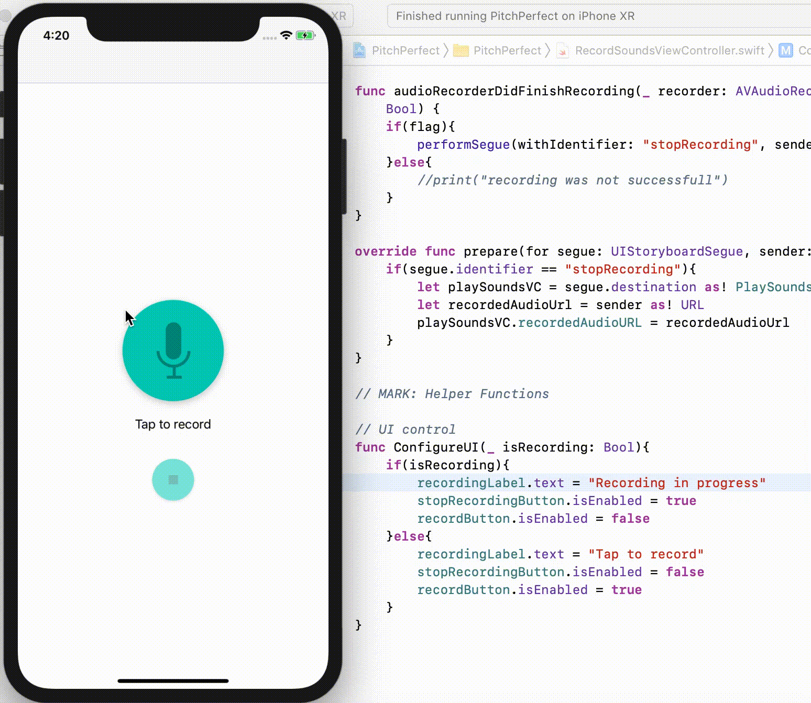

# PitchPerfect iOS App

This **Udacity course** app, is an iOS app that is built using **Swift** that allows the user to record audio, and play it back using a range of audio manipulation options.
The course went over several concepts in iOS and Xcode:
1. Xcode navigation/utility/terminal/debugger sections
2. App life cycle (not running, inactive, active, background, suspended)
3. IOS frameworks:
 a. UIKit
 b. AVFoundation
4. ViewController
5. UINavigationController
6. StackView
7. AVAudioRecorder
8. UIButtons
9. IBActions
10. IBOutlets
